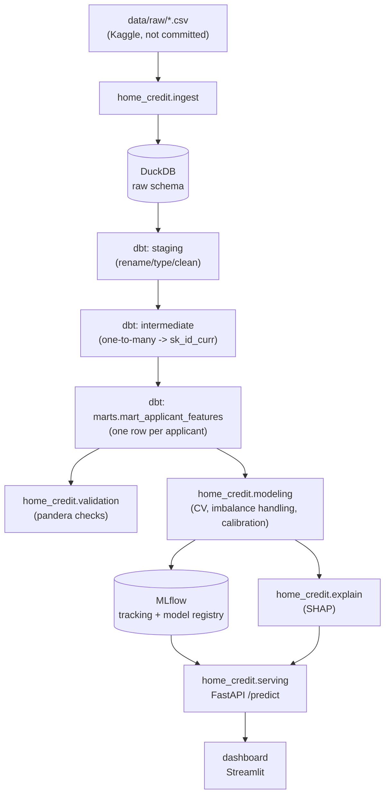

# Home Credit Default Risk

**Problem.** Predict whether a loan applicant will default (`TARGET = 1`,
~8% of applicants) using the [Home Credit Default Risk](https://www.kaggle.com/competitions/home-credit-default-risk)
dataset. The applicant table alone is ~307k rows, but the real size - and
the real engineering problem - is in six related history tables (credit
bureau records, previous applications, POS/cash balances, credit card
balances, instalment payments), tens of millions of rows combined, all
one-to-many against a single applicant. Getting from "seven relational
tables at different grains" to "one row per applicant, ready to fit a
classifier" is a genuine data-engineering problem, and it's the part of
this project that gets the most weight - the model on top of it is
deliberately the less novel half.

**Status.** Built in phases, each reviewed before the next starts. See
[Project status](#project-status) below for what's actually implemented
right now vs. planned.

## Architecture



## Project status

| Phase | Scope | Status |
|---|---|---|
| 1 | Project scaffold (`src/` layout, `pyproject.toml`, Makefile, README) | done |
| 2 | Data ingestion into DuckDB (`home_credit.ingest`) | done |
| 3 | dbt transformation layer (staging -> intermediate -> marts) | **done** (built pre-scaffold, see below) |
| 4 | Feature engineering + EDA summary | done |
| 5 | Modelling: baseline LR, LightGBM + XGBoost, stratified k-fold CV, calibration, MLflow | done |
| 6 | Explainability (global + per-applicant SHAP) | done |
| 7 | Serving: FastAPI `/predict` + Streamlit dashboard | done |
| 8 | Docker, CI, data validation, monitoring/retraining notes | pending (basic CI exists, see below) |

The dbt project (`warehouse/`) was built and validated first and already
meets phase 3's bar as specified, so it isn't being redone - phases 2, 4-8
build around it. The original pre-scaffold `modeling/` package (single
train/valid split, LightGBM only, no MLflow) was replaced, not migrated,
by `src/home_credit/modeling` in phase 5 and has been removed.

## Repository layout

```
src/home_credit/       Installable package (pip install -e .)
  config.py             Central paths/constants - everything else imports from here
  data.py                loads mart_applicant_features - the shared read path
  features.py            feature-column selection, dtype prep, linear-model preprocessing
  eda.py                 generates docs/eda_summary.md
  ingest/                raw CSV -> DuckDB, with schema/row-count/uniqueness checks
  modeling/              CV model comparison, champion selection, calibration, MLflow logging
  explain/               global + per-applicant SHAP (tree champions)
  validation/            Phase 8: pandera schemas
  serving/               FastAPI scoring app (api.py)
dashboard/               Streamlit dashboard (app.py)
warehouse/               dbt project: staging -> intermediate -> marts (done)
scripts/                 build_warehouse.sh (ingest -> dbt build -> dbt docs generate)
docs/                    eda_summary.md (committed EDA report - see caveat below)
tests/                   pytest suite + synthetic fixture generator
data/raw/                Kaggle CSVs go here (gitignored)
```

## Expected raw data

This repo does not download or vendor the dataset. Get it from
[Kaggle](https://www.kaggle.com/competitions/home-credit-default-risk/data)
and place these files in `data/raw/` (filenames must match exactly - the
loader reads them by name):

```
data/raw/application_train.csv
data/raw/application_test.csv
data/raw/bureau.csv
data/raw/bureau_balance.csv
data/raw/previous_application.csv
data/raw/POS_CASH_balance.csv
data/raw/credit_card_balance.csv
data/raw/installments_payments.csv
```

(`HomeCredit_columns_description.csv` and `sample_submission.csv`, also in
the Kaggle download, aren't used by anything here.)

## Data ingestion (done)

`home_credit.ingest.load_raw_data` (`python -m home_credit.ingest.load_raw_data`,
or `make ingest`) loads each CSV into DuckDB's `raw` schema untouched - dbt
staging models do all renaming/typing, so ingestion's only job is getting
the bytes in and catching a bad download early:

- **Missing-file check** - lists every file still missing from `data/raw/`
  and points at the Kaggle download page, rather than failing on the first
  absent file.
- **Schema check** - each table's grain/foreign-key columns
  (`src/home_credit/ingest/schemas.py`) must actually exist in the loaded
  CSV, so a renamed or reshuffled column fails here with a specific message
  instead of as an obscure `dbt` compile error three layers downstream.
- **Row-count and null checks** - a table that loads 0 rows, or has a null
  in a column that's supposed to be a foreign key, fails immediately.
- **Uniqueness check** - `application_train`/`application_test` on
  `SK_ID_CURR` and `bureau` on `SK_ID_BUREAU` must actually be unique at
  their claimed grain.

This is deliberately lighter than the `dbt` tests one layer up (which also
check cross-table `relationships` and `accepted_values`) and lighter still
than the `pandera` validation phase 8 will add against the built mart - it
exists to fail fast on "wrong file" / "truncated download", not to
duplicate either of those.

## The dbt pipeline (done)

**Staging** (`warehouse/models/staging/`): one view per source table,
renamed to consistent snake_case, with the dataset's known data-quality
quirks fixed at the source: `DAYS_EMPLOYED == 365243` is a documented "not
applicable" sentinel (flagged as `is_pensioner_anomaly` and nulled out, same
treatment applied to the equivalent sentinel in `previous_application`'s
`DAYS_*` columns), and `DAYS_*` columns are sign-flipped into positive
"years/days ago" so they read naturally. The ~45 `*_AVG`/`_MODE`/`_MEDI`
apartment/building columns on `application` are collapsed into a single
`housing_quality_score` and `housing_info_missing_rate` - they're mutually
correlated measurements of the same underlying "how well is this building
documented" signal, and missingness itself is a known predictive feature in
this dataset, so this keeps that signal without carrying 45 near-duplicate
columns through every downstream model.

**Intermediate** (`warehouse/models/intermediate/`): this is where the
one-to-many joins actually get resolved. `bureau_balance` (grain:
`sk_id_bureau, months_balance`) is aggregated up to `sk_id_bureau` first
(`int_bureau_balance_agg`), then joined onto `bureau` and aggregated again
up to `sk_id_curr` (`int_bureau_agg`) - a genuine two-level rollup, since
`bureau_balance` doesn't carry `sk_id_curr` directly. The other four history
tables (`previous_application`, `pos_cash_balance`, `credit_card_balance`,
`installments_payments`) do carry `sk_id_curr` directly and are aggregated
to that grain in one step each. Each aggregation produces both raw
summaries (counts, sums) and engineered ratios (debt-to-credit,
late-payment rate, credit-card utilization, approval rate) - the kind of
feature a lender's risk team would actually reason about, not just a
mechanical `AVG(*)` over every numeric column.

**Marts** (`warehouse/models/marts/`): `mart_applicant_features` left-joins
the applicant record to all six aggregations. Count-style columns are
coalesced to `0` when an applicant has no history in a source (a true
zero); ratio/average columns are left `NULL` (LightGBM and XGBoost both
split on missingness natively - imputing a sentinel would destroy that
signal). A `has_*_history` boolean is added per source, so "no history" is
still directly queryable and shows up as its own SHAP feature instead of
being buried in nulls.

**dbt tests**: `unique`/`not_null` on every grain key, `relationships` tests
enforcing every history table's foreign key actually exists in its parent
(e.g. every `bureau.sk_id_curr` exists in `application`), an
`accepted_values` test on `target`, and a singular test
(`warehouse/tests/assert_train_test_target_consistency.sql`) asserting
training rows always have a label and scoring rows never do.

## Feature engineering & EDA (done)

**`src/home_credit/features.py`** is the single place that decides how a
"feature" is typed, shared by the EDA report and every model in
`src/home_credit/modeling`:

- Numeric vs. categorical is inferred from pandas dtype (`split_column_types`).
- For the tree models (LightGBM, XGBoost): categoricals become pandas
  `category` dtype, and missing values are left alone - both models split
  on missingness natively, so imputing here would destroy real signal (a
  `NULL` in `cc_utilization_avg`, for instance, means "no credit card
  history," not "unknown utilization").
- For the baseline logistic regression, which can't handle missing values
  or raw strings: `build_linear_preprocessor` median-imputes + standardizes
  numeric columns, most-frequent-imputes + one-hot-encodes categoricals
  (`handle_unknown='ignore'`, so a category unseen in training doesn't
  crash scoring).

**`src/home_credit/eda.py`** (`make eda`) generates `docs/eda_summary.md`:
missingness by column, the numeric features most correlated with `TARGET`,
and the categorical features with the widest target-rate spread (restricted
to categories with at least 20 applicants, so one outlier doesn't dominate).

> **Caveat on the committed report:** `docs/eda_summary.md` in this repo was
> generated against the synthetic fixtures, not the real Kaggle data - the
> numbers in it are noise (max correlation ~0.18 on 400 synthetic rows),
> not real default drivers. It's committed to document the report's shape;
> re-run `make eda` after building the warehouse against the real dataset
> to get a meaningful one.

## Modelling (done)

`src/home_credit/modeling` (`make train`, or `python -m home_credit.modeling.run_pipeline`):

1. **Cross-validated model comparison** (`cv.py`, `models.py`) - stratified
   5-fold CV (`StratifiedKFold`, preserving the ~8% positive rate in every
   fold) for three model types behind one shared `fit`/`predict_proba`
   interface: a baseline logistic regression, LightGBM, and XGBoost.
   - **Imbalance handling**: `scale_pos_weight` (negative/positive count)
     for the tree models, `class_weight='balanced'` for the baseline -
     reweighting the existing gradient/loss per class rather than
     resampling (SMOTE, random oversampling). Interpolating synthetic rows
     in a feature space built from subtle, correlated financial ratios is
     more likely to produce unrealistic applicants than reweighting is to
     mis-calibrate - and reweighting composes cleanly with the calibration
     step that follows, which corrects exactly the probability skew it
     introduces.
   - Both tree models carve out their own small validation split from
     *their own* training data for early stopping - never from the CV fold
     or holdout they're scored on, which would leak information into the
     score.
   - The champion is picked by mean CV **PR-AUC**, not ROC-AUC - at an ~8%
     positive rate, PR-AUC is what actually separates a useful model from
     a useless one; ROC-AUC is logged too but can look deceptively good on
     imbalanced data.
2. **Calibration** (`calibrate.py`) - the champion is refit on a training
   split and calibrated with isotonic regression
   (`CalibratedClassifierCV` + `FrozenEstimator`) on a holdout it never
   saw, correcting the probability skew `scale_pos_weight`/`class_weight`
   introduce without touching ranking.
3. **Evaluation** (`evaluate.py`) - ROC-AUC, PR-AUC, KS statistic, and
   Brier score on that same holdout, before and after calibration, plus a
   calibration curve plot (`reports/calibration_curve.png`).
4. **MLflow** (`train.py`) - one parent run per training call
   (`model_comparison`), one nested child run per model type with every
   fold's ROC-AUC/PR-AUC plus the mean/std, the champion's holdout metrics
   (both un/calibrated), and the calibration curve as a logged artifact.
   Tracking store is local SQLite (`mlflow.db` - MLflow >=3 deprecated the
   plain filesystem backend); view it with `mlflow ui --backend-store-uri
   sqlite:///mlflow.db`.
5. **`predict.py`** scores `application_test` with the calibrated champion
   and writes a Kaggle-format `reports/submission.csv`.

A production-scoped caveat, noted here rather than hidden: the same
holdout is used to fit the calibrator *and* report final metrics, since
it's the only data the champion never trained on. A production build would
carve out a third, fully untouched fold for that final number - left out
here as a portfolio-scoped simplification of a fairly standard technique.

## Explainability (done)

`src/home_credit/explain/shap_explainer.py` (`make explain`) - global and
per-applicant SHAP, both against the champion's raw underlying estimator
(`champion_model.joblib`), not the calibrated wrapper: explaining an
isotonic regression stacked on top of a tree model would attribute credit
on the wrong scale (post-calibration probability rather than the tree's
own margin) - the trees make the risk decision, calibration only rescales
it, so the trees are the correct explanation target.

- **Global** (`compute_global_importance` / `main`): `shap.TreeExplainer`
  over a sample of the training set, writing `reports/shap_summary.png`
  (a beeswarm plot) and `reports/shap_feature_importance.csv` (mean
  absolute SHAP value per feature, ranked).
- **Per-applicant** (`explain_applicant(sk_id_curr)`): base value + every
  feature's signed contribution for one applicant, sorted by
  `|contribution|` - `base_value + sum(contributions) == predicted_score`
  by construction. This is what phase 7's API/dashboard will surface as
  "why did this applicant get this score."

**Scoped to the tree champions (LightGBM/XGBoost) only.** A model-agnostic
fallback for the logistic-regression baseline was tried and dropped: SHAP's
default masker computes `numpy.isclose` differences directly against the
raw background sample, which crashes on this dataset's string-typed
categorical columns before ever reaching the pipeline's own preprocessing
- confirmed by actually running it, not by inspection. Making that path
work correctly (explaining the pipeline in its post-one-hot-encoded space,
then mapping values on expanded dummy columns back to the original
business features) is real, non-trivial work that's out of scope here;
`build_explainer` raises a clear `NotImplementedError` rather than
silently running a fallback that's actually broken. Given this dataset's
heavy missingness and many categoricals, a tree model reliably outperforms
the linear baseline in practice anyway.

## Serving (done)

**`src/home_credit/serving/api.py`** (`make serve-api`) - a FastAPI app
scoring applicants already present in the mart, by `sk_id_curr`, not raw
application fields:

```
GET /health
GET /predict/{sk_id_curr}   -> calibrated default probability
GET /explain/{sk_id_curr}   -> base value + per-feature SHAP contributions
```

Scoring by ID against the mart rather than accepting raw applicant fields
in the request body is a deliberate choice: the mart *is* the feature
store (~130 engineered features aggregated from six history tables), and
an internal risk API in a real deployment would sit on top of a
precomputed feature store rather than recomputing all of that per request.
Model, feature metadata, and the SHAP explainer are all loaded once at
FastAPI startup (`lifespan`), and each endpoint does a single-row DuckDB
lookup rather than loading the whole mart into pandas - loading ~307k rows
per request wouldn't scale on the real dataset. `/explain` returns `501`
for a non-tree champion, mirroring the explainability module's own scope.

**`dashboard/app.py`** (`make dashboard`) - a Streamlit app for browsing
applicants (either the training or scoring pool) by `sk_id_curr`, showing
the calibrated probability, a risk tier (illustrative cut points, not a
real cost/benefit analysis), and - for tree champions - the SHAP drivers
behind the score as a diverging red/blue bar chart (increases vs. decreases
risk), plus the global SHAP summary image from `make explain`. It reuses
the same public primitives from `home_credit.explain.shap_explainer` as
the API (`load_champion`, `build_explainer`, `contributions_for_row`, ...)
so the two serving surfaces never disagree on how a contribution is
computed or formatted.

**Category-dtype consistency (train vs. serving).** Both the API and the
dashboard score one applicant row at a time. Casting a single row to
pandas `category` dtype independently derives that column's categories
from only what's present in *that row* - zero categories if the value
happens to be null, which crashed XGBoost's native categorical handling.
Fixed by capturing each categorical column's full category universe once
at training time (`extract_categories`, persisted into
`feature_metadata.json`) and passing it into every inference-time call to
`prepare_tree_dtypes` (`predict.py`, `shap_explainer.py`, `api.py`,
`dashboard/app.py`) - not just to avoid the crash, but because inconsistent
category encoding between train and inference is a silent correctness bug
even when it doesn't crash. Covered by regression tests in
`tests/test_features.py`.

## Setup

```bash
python3 -m venv .venv && source .venv/bin/activate
make setup        # pip install -e ".[dev]" - installs the src/home_credit package + dev tools

# 1. place the Kaggle CSVs in data/raw/ (see "Expected raw data" above)
make dbt-build     # load raw CSVs -> dbt build (staging -> intermediate -> marts) -> dbt docs generate
make train         # cross-validate LR/LightGBM/XGBoost -> champion -> calibrate -> evaluate -> log to MLflow
make explain       # SHAP: reports/shap_summary.png + shap_feature_importance.csv
make serve-api     # FastAPI on :8000 - GET /predict/{sk_id_curr}, /explain/{sk_id_curr}
make dashboard     # Streamlit dashboard on :8501
```

Run `make` with no target (or open the `Makefile`) for the full command
list - `lint` lands with phase 8; `setup`, `dbt-build`, `eda`, `train`,
`explain`, `serve-api`, `dashboard`, and `test` are live.

### Trying it without the real dataset

`tests/generate_synthetic_data.py` generates small, schema-faithful
synthetic CSVs (proper referential integrity between `sk_id_curr`,
`sk_id_bureau`, `sk_id_prev`) for all eight tables, so the pipeline can be
exercised without the (non-redistributable) Kaggle download:

```bash
python tests/generate_synthetic_data.py         # writes tests/fixtures/raw/
DATA_RAW_DIR=tests/fixtures/raw DUCKDB_PATH=/tmp/dev.duckdb python -m home_credit.ingest.load_raw_data
DBT_PROFILES_DIR=warehouse DUCKDB_PATH=/tmp/dev.duckdb dbt build --project-dir warehouse
DUCKDB_PATH=/tmp/dev.duckdb python -m home_credit.modeling.run_pipeline
DUCKDB_PATH=/tmp/dev.duckdb python -m home_credit.explain.shap_explainer
```

This is exactly what CI (`.github/workflows/ci.yml`) does today, plus
running the full `pytest` suite against the resulting warehouse; phase 8
will extend it with lint once phase 7 lands.

## Results

Run against the synthetic fixtures (400 training rows, no real signal -
this is a pipeline-correctness check, not a meaningful benchmark): all
three models cross-validate, XGBoost was selected as champion by mean CV
PR-AUC, and calibration reduced the holdout Brier score from ~0.20 to
~0.06 (calibration corrects probability skew - it doesn't and shouldn't
improve ranking metrics on data with no real signal to rank).

**Re-run `make train` against the real dataset for numbers worth
reporting** - `reports/train_summary.json` (CV fold-by-fold and aggregate
ROC-AUC/PR-AUC per model, champion, holdout metrics before/after
calibration) and `reports/calibration_curve.png` are regenerated each run
and gitignored, same treatment as the EDA report above.

## Design decisions

- **DuckDB, not Postgres/Snowflake.** Zero external services to provision;
  `dbt-duckdb` gives a real warehouse (schemas, materializations, tests,
  docs) against a single local file.
- **Housing/building columns collapsed, not dropped or kept in full.** See
  the dbt pipeline section above - keeps the missingness signal without
  ~45 near-duplicate columns.
- **`src/` package layout.** Keeps the installable library
  (`home_credit`) separate from top-level scripts, tests, and the dbt
  project, and makes `pip install -e .` unambiguous about what's a package.
- **Schema/row-count checks live in ingestion, not just in dbt.** A dbt
  `not_null`/`unique` test only runs *after* `dbt build` has already parsed
  and materialized every model - by the time it fails, the error is several
  layers removed from "the CSV was wrong." Checking grain columns, row
  counts, and uniqueness right after the raw load means a bad download
  fails with a specific, immediate message instead of a confusing
  downstream compile or test error.
- **No feature store / Airflow.** The project is scoped to one batch
  build; orchestration beyond `scripts/build_warehouse.sh` would be
  solving a problem this dataset doesn't have.
- **`scale_pos_weight`/`class_weight='balanced'`, not SMOTE.** See the
  Modelling section above - reweighting composes cleanly with the
  calibration step that follows; resampling would need its own
  calibration correction on top, for a technique more likely to produce
  unrealistic synthetic applicants in this feature space than to help.
- **Champion selection by PR-AUC, not ROC-AUC.** At an ~8% positive rate,
  ROC-AUC can look deceptively good (it's dominated by the easy majority
  class); PR-AUC is what actually reflects performance on the minority
  class this problem cares about.
- **Booleans treated as numeric (0/1), not categorical**, in
  `features.split_column_types`. They scale/split identically to any
  other numeric feature for every model here, and treating them as
  categorical caused two real bugs during development: XGBoost's native
  categorical handling requires string-typed categories and crashes on
  boolean ones, and combining multiple pandas `category`-dtype columns of
  different underlying value types (bool alongside string) in one
  `SimpleImputer` call hits a real pandas/sklearn dtype-promotion bug.
  Both were caught by actually running the pipeline against real data,
  not by reasoning about it - see the module docstrings in
  `features.py`/`train.py` for the full detail.

More decisions (monitoring/retraining approach, SHAP explanation target)
will be documented here as phases 6-8 land.
