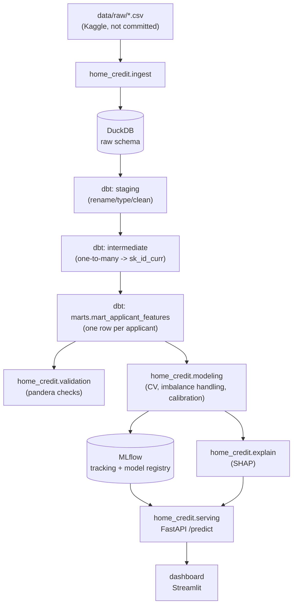

# Home Credit Default Risk

**Problem.** Predict whether a loan applicant will default (`TARGET = 1`,
~8% of applicants) using the [Home Credit Default Risk](https://www.kaggle.com/competitions/home-credit-default-risk)
dataset. The applicant table alone is ~307k rows, but the real size - and
the real engineering problem - is in six related history tables (credit
bureau records, previous applications, POS/cash balances, credit card
balances, instalment payments), tens of millions of rows combined, all
one-to-many against a single applicant. Getting from "seven relational
tables at different grains" to "one row per applicant, ready to fit a
classifier" is a genuine data-engineering problem, and it's the part of
this project that gets the most weight - the model on top of it is
deliberately the less novel half.

**Status.** Built in phases, each reviewed before the next starts. See
[Project status](#project-status) below for what's actually implemented
right now vs. planned.

## Architecture



## Project status

| Phase | Scope | Status |
|---|---|---|
| 1 | Project scaffold (`src/` layout, `pyproject.toml`, Makefile, README) | done |
| 2 | Data ingestion into DuckDB (`home_credit.ingest`) | pending |
| 3 | dbt transformation layer (staging -> intermediate -> marts) | **done** (built pre-scaffold, see below) |
| 4 | Feature engineering + EDA summary | pending |
| 5 | Modelling: baseline LR, LightGBM + XGBoost, stratified k-fold CV, calibration, MLflow | pending (an earlier single-split LightGBM version exists in the legacy `modeling/` package, superseded in this phase) |
| 6 | Explainability (global + per-applicant SHAP) | pending (legacy global-only version exists in `modeling/explain.py`) |
| 7 | Serving: FastAPI `/predict` + Streamlit dashboard | pending |
| 8 | Docker, CI, data validation, monitoring/retraining notes | pending (basic CI exists, see below) |

The dbt project (`warehouse/`) was built and validated first and already
meets phase 3's bar as specified, so it isn't being redone - phases 2, 4-8
build around it. The top-level `modeling/` package is an earlier iteration
(single train/valid split, LightGBM only, no MLflow) kept in place until
phase 5 replaces it with `src/home_credit/modeling` (cross-validated,
both LightGBM and XGBoost, MLflow-tracked); it isn't the target architecture
described above.

## Repository layout

```
src/home_credit/       Installable package (pip install -e .)
  config.py             Central paths/constants - everything else imports from here
  ingest/                Phase 2: raw CSV -> DuckDB
  validation/            Phase 8: pandera schemas
  modeling/              Phase 5: feature prep, CV training, calibration, MLflow logging
  explain/               Phase 6: SHAP
  serving/               Phase 7: FastAPI app
dashboard/               Phase 7: Streamlit app
warehouse/               dbt project: staging -> intermediate -> marts (done)
scripts/                 load_raw_data.py, build_warehouse.sh
tests/                   pytest suite + synthetic fixture generator
modeling/                Legacy pre-scaffold modelling code, superseded in phase 5
data/raw/                Kaggle CSVs go here (gitignored)
```

## Expected raw data

This repo does not download or vendor the dataset. Get it from
[Kaggle](https://www.kaggle.com/competitions/home-credit-default-risk/data)
and place these files in `data/raw/` (filenames must match exactly - the
loader reads them by name):

```
data/raw/application_train.csv
data/raw/application_test.csv
data/raw/bureau.csv
data/raw/bureau_balance.csv
data/raw/previous_application.csv
data/raw/POS_CASH_balance.csv
data/raw/credit_card_balance.csv
data/raw/installments_payments.csv
```

(`HomeCredit_columns_description.csv` and `sample_submission.csv`, also in
the Kaggle download, aren't used by anything here.)

## The dbt pipeline (done)

**Staging** (`warehouse/models/staging/`): one view per source table,
renamed to consistent snake_case, with the dataset's known data-quality
quirks fixed at the source: `DAYS_EMPLOYED == 365243` is a documented "not
applicable" sentinel (flagged as `is_pensioner_anomaly` and nulled out, same
treatment applied to the equivalent sentinel in `previous_application`'s
`DAYS_*` columns), and `DAYS_*` columns are sign-flipped into positive
"years/days ago" so they read naturally. The ~45 `*_AVG`/`_MODE`/`_MEDI`
apartment/building columns on `application` are collapsed into a single
`housing_quality_score` and `housing_info_missing_rate` - they're mutually
correlated measurements of the same underlying "how well is this building
documented" signal, and missingness itself is a known predictive feature in
this dataset, so this keeps that signal without carrying 45 near-duplicate
columns through every downstream model.

**Intermediate** (`warehouse/models/intermediate/`): this is where the
one-to-many joins actually get resolved. `bureau_balance` (grain:
`sk_id_bureau, months_balance`) is aggregated up to `sk_id_bureau` first
(`int_bureau_balance_agg`), then joined onto `bureau` and aggregated again
up to `sk_id_curr` (`int_bureau_agg`) - a genuine two-level rollup, since
`bureau_balance` doesn't carry `sk_id_curr` directly. The other four history
tables (`previous_application`, `pos_cash_balance`, `credit_card_balance`,
`installments_payments`) do carry `sk_id_curr` directly and are aggregated
to that grain in one step each. Each aggregation produces both raw
summaries (counts, sums) and engineered ratios (debt-to-credit,
late-payment rate, credit-card utilization, approval rate) - the kind of
feature a lender's risk team would actually reason about, not just a
mechanical `AVG(*)` over every numeric column.

**Marts** (`warehouse/models/marts/`): `mart_applicant_features` left-joins
the applicant record to all six aggregations. Count-style columns are
coalesced to `0` when an applicant has no history in a source (a true
zero); ratio/average columns are left `NULL` (LightGBM and XGBoost both
split on missingness natively - imputing a sentinel would destroy that
signal). A `has_*_history` boolean is added per source, so "no history" is
still directly queryable and shows up as its own SHAP feature instead of
being buried in nulls.

**dbt tests**: `unique`/`not_null` on every grain key, `relationships` tests
enforcing every history table's foreign key actually exists in its parent
(e.g. every `bureau.sk_id_curr` exists in `application`), an
`accepted_values` test on `target`, and a singular test
(`warehouse/tests/assert_train_test_target_consistency.sql`) asserting
training rows always have a label and scoring rows never do.

## Setup

```bash
python3 -m venv .venv && source .venv/bin/activate
make setup        # pip install -e ".[dev]" - installs the src/home_credit package + dev tools

# 1. place the Kaggle CSVs in data/raw/ (see "Expected raw data" above)
make dbt-build     # load raw CSVs -> dbt build (staging -> intermediate -> marts) -> dbt docs generate
```

Run `make` with no target (or open the `Makefile`) for the full command
list - `train`, `serve-api`, `dashboard`, `test`, `lint` etc. land as their
phases are built; right now `setup` and `dbt-build` are live.

### Trying it without the real dataset

`tests/generate_synthetic_data.py` generates small, schema-faithful
synthetic CSVs (proper referential integrity between `sk_id_curr`,
`sk_id_bureau`, `sk_id_prev`) for all eight tables, so the pipeline can be
exercised without the (non-redistributable) Kaggle download:

```bash
python tests/generate_synthetic_data.py         # writes tests/fixtures/raw/
RAW_DIR=tests/fixtures/raw DUCKDB_PATH=/tmp/dev.duckdb python scripts/load_raw_data.py
DBT_PROFILES_DIR=warehouse DUCKDB_PATH=/tmp/dev.duckdb dbt build --project-dir warehouse
```

This is exactly what CI (`.github/workflows/ci.yml`) does today; phase 8
will extend it with lint and the full test suite once phases 2-7 land.

## Results

_Filled in during phase 5 (baseline vs. LightGBM/XGBoost CV results,
calibration curves) - not implemented yet._

## Design decisions

- **DuckDB, not Postgres/Snowflake.** Zero external services to provision;
  `dbt-duckdb` gives a real warehouse (schemas, materializations, tests,
  docs) against a single local file.
- **Housing/building columns collapsed, not dropped or kept in full.** See
  the dbt pipeline section above - keeps the missingness signal without
  ~45 near-duplicate columns.
- **`src/` package layout.** Keeps the installable library
  (`home_credit`) separate from top-level scripts, tests, and the dbt
  project, and makes `pip install -e .` unambiguous about what's a package.
- **No feature store / Airflow.** The project is scoped to one batch
  build; orchestration beyond `scripts/build_warehouse.sh` would be
  solving a problem this dataset doesn't have.

More decisions (imbalance handling, calibration method, LightGBM vs.
XGBoost, monitoring/retraining approach) will be documented here as their
phases land - see the legacy `modeling/` package's docstrings for the
reasoning that phase 5 will carry forward.
